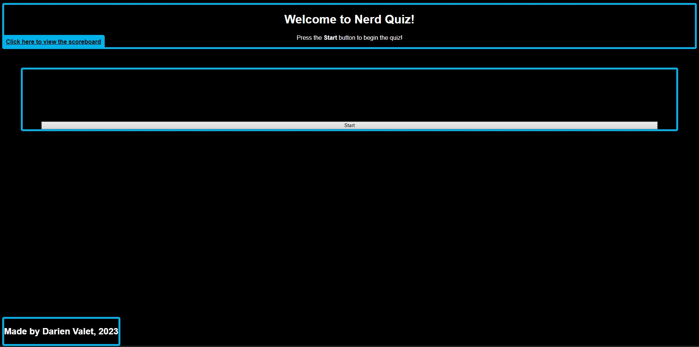

# Nerd Quiz
Prove you're the biggest JavaScript nerd with this hand crafted quiz! This is a quiz site made by Darien Valet for the coding bootcamp provided through KU. The site demonstrates the use of local storage functions by incorporating a locally saved scoreboard! You can easily clear the scoreboard using the button bellow the scoreboard.

## Page Preview
This is what the page should look like when launched properly, or viewed on a web browser.

## Webpage Link
> **Use this link to view the webpage:** [link to the webpage](https://antimatternova.github.io/NerdQuiz/)